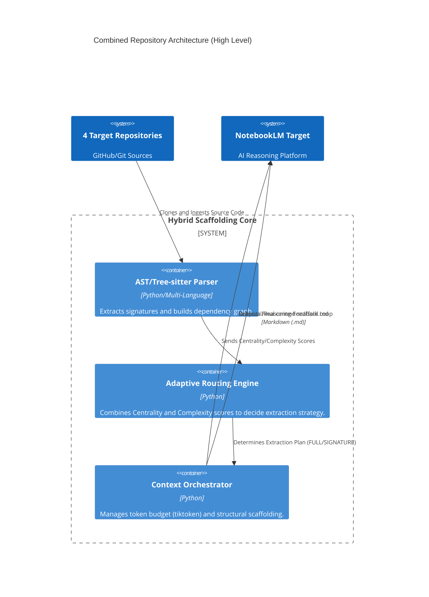

# 🗺️ System Context Diagram (C4 Level 1)

> This diagram defines the high-level system boundaries and interfaces for the combined architecture derived from the four repositories. This is designed to be machine-readable by LLMs.

## Architecture Visualization (Mermaid)

